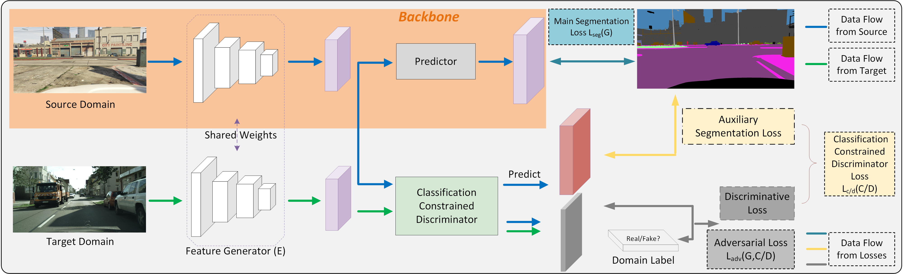

# Classification Constrained Discriminator for Domain Adaptive Semantic Segmentation


Introduction
------------
This is the source code for our paper **Classification Constrained Discriminator for Domain Adaptive Semantic Segmentation**


Network Architecture
--------------------
The architecture of our proposed model is as follows



## Installation
* Install PyTorch 0.4 with Python 3 and CUDA 8.0 

* Clone this repo
```
git clone https://github.com/NUST-Machine-Intelligence-Laboratory/ccd.git

```
## Dataset
* Download the [GTA5 Dataset](https://download.visinf.tu-darmstadt.de/data/from_games/) as the source domain, and put it in the `GTA5` folder

* Download the [Cityscapes Dataset](https://www.cityscapes-dataset.com/) as the target domain, and put it in the `Cityscapes` folder

## Testing

```
cd ccd

```

* Download the trained VGG model [GTA5-to-Cityscapes VGG model](https://drive.google.com/open?id=1TUYOiTpsdYCzv4HI2n2fv5_cjRkru14v) and put it in the `ccd_model` folder

```
python evaluate_cityscapes.py --model VGG --restore-from ./ccd_model/GTA5_vgg_37.58.pth
python compute_iou.py ../Cityscapes/gtFine/val result/cityscapes

```
* Or,download the trained ResNet model [GTA5-to-Cityscapes ResNet model](https://drive.google.com/open?id=1sCfn38dGk3xXlrLSTmPobw3QaLgyxUh8) and put it in the `ccd_model` folder

```
python evaluate_cityscapes.py --model ResNet --restore-from ./ccd_model/GTA5_resnet_42.65.pth
python compute_iou.py ../Cityscapes/gtFine/val result/cityscapes

```
## Training
* Download the initial pre-trained VGG model [Initial VGG model](https://drive.google.com/open?id=15jYhUjWFxAyMy4XVBDxhwvlRN5xZFdD1) and put it in the `model` folder

```
python train.py --model VGG --snapshot-dir ./snapshots/GTA2Cityscapes --lambda-adv-target 0.001 --lambda-s 0.5

```
* Or,download the initial pre-trained ResNet model [Initial ResNet model](https://drive.google.com/open?id=1yYNtx_fKeJaSqk1vk0IFAkLVw6rILKZF) and put it in the `model` folder

```
python train.py --model ResNet --snapshot-dir ./snapshots/GTA2Cityscapes --lambda-adv-target 0.001 --lambda-s 0.5

```
* Tip: The best-performance model might not be the final one in the last epoch. If you want to evaluate every saved models in bulk, please use bulk_evaluate.py and bulk_iou.py, the result will be saved in an Excel sheet.

```
python bulk_evaluate.py
python bulk_iou.py

```

## Acknowledgements
This code is heavily borrowed from [AdaptSegNet](https://github.com/wasidennis/AdaptSegNet)


## Citation

If you find this useful in your research, please consider citing:

    @inproceedings{chen2020classification,
	title={Classification Constrained Discriminator for Domain Adaptive Semantic Segmentation},
	author={Tao Chen, Jian Zhang, Guo-Sen Xie, Yazhou Yao, Xiaoshui Huang, Zhenmin Tang},
	booktitle={IEEE International Conference on Multimedia and Expo (ICME)},
	year={2020}
	}